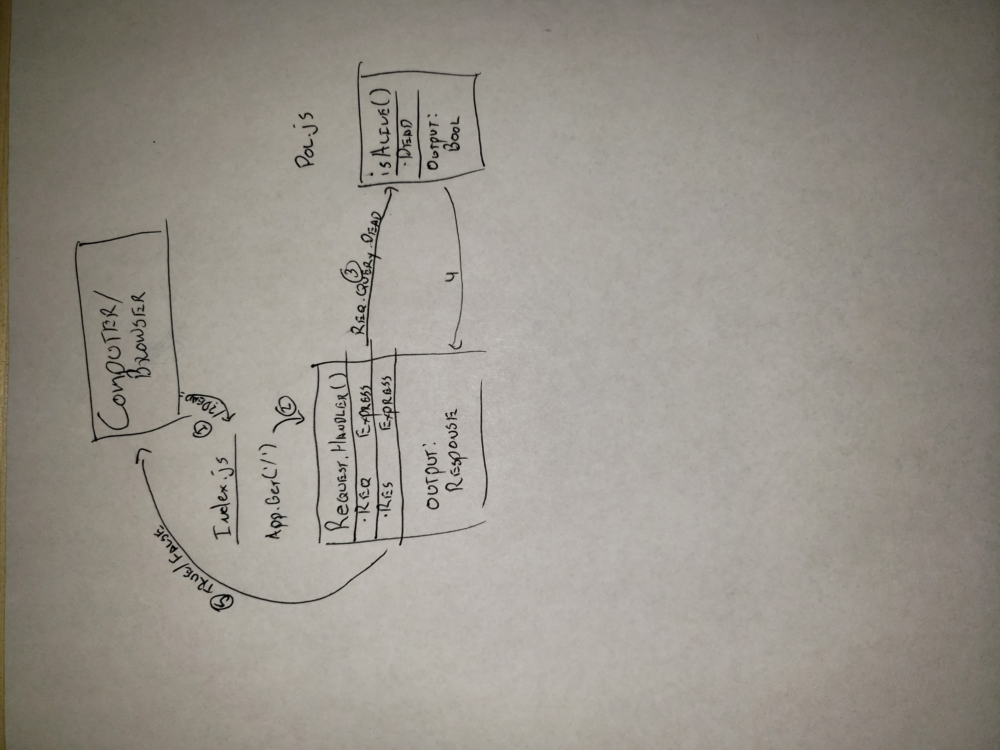

 LAB
=================================================

## LAB - 00

## Proof of Life Server

### Author: James Portune

### Links and Resources
* [repo](https://github.com/401-advanced-javascript-portune/lab-00/pull/1)
* [travis](https://travis-ci.com/401-advanced-javascript-portune/lab-00)
* [front-end](https://portune-lab-00.herokuapp.com/)

#### Documentation
* [jsdoc](https://portune-lab-00.herokuapp.com/docs)

### Modules
#### `pol.js
##### Exported Values and Methods

###### `isAlive(dead) -> boolean`
Returns true/false to indicate how the server works

### Setup
#### `.env` requirements
* `PORT` - Port Number

#### Running the app
* `npm start`
* Endpoint: `/`
  * Returns a Boolean
* Endpoint: `/docs`
  * Returns JSDoc Docu Pages
  
#### Tests
* Unit Tests: `npm test`
* Lint Tests: `npm run lint`

#### UML

